# PresciSE - Project Overview

**PresciSE** (Precision Scientific Search Engine) is a hybrid retrieval system designed for scientific literature. It combines BM25 (keyword-based) and FAISS (semantic vector search) with a dynamic router and LangChain/LangGraph agent to intelligently retrieve and answer questions from scientific documents.

---

## Complete Data Flow Diagram

```mermaid
flowchart TD
    %% Phase 1: Document Ingestion & Indexing (Offline)
    subgraph PHASE1_OFFLINE["📦 PHASE 1A: Document Ingestion (Offline)"]
        PDF[("📄 PDF Documents<br/>(data/pdfs/)")]
        PDF --> Docling["Docling Parser<br/>(Structure Extraction)"]
        Docling --> Sections["Sections<br/>(Title, Text, Tables)"]
        Sections --> Chunker["PDF Chunker<br/>(900 chars, 150 overlap)"]
        Chunker --> Chunks["Text Chunks<br/>(with metadata)"]
        
        Chunks --> NLP_Meta["Metadata Extraction<br/>• Keywords (7)<br/>• NER (entities)<br/>• Section type"]
        Chunks --> Embedder["SPECTER Embedder<br/>(768-dim scientific)"]
        
        NLP_Meta --> BM25["BM25 Index<br/>(Keyword search)"]
        Embedder --> FAISS["FAISS Index<br/>(Vector search)"]
        
        BM25 --> IndexSave["💾 Save Indexes<br/>(data/index/)"]
        FAISS --> IndexSave
    end
    
    %% Phase 1: Query Processing & Retrieval (Online)
    subgraph PHASE1_ONLINE["🔍 PHASE 1B: Query Processing & Retrieval (Online)"]
        Query["👤 User Query<br/>'How does MD help in drug discovery?'"]
        Query --> Tokenize["Tokenization<br/>(Lemmatization)"]
        Query --> EmbedQuery["Query Embedding<br/>(SPECTER 768-dim)"]
        
        Tokenize --> RouterLLM["🤖 LLM CALL #1<br/><b>Qwen2.5-1.5B Router</b><br/>(Query Analysis)"]
        
        style RouterLLM fill:#ff6b6b,stroke:#c92a2a,stroke-width:3px,color:#fff
        
        RouterLLM --> RouterDecision{"Router Decision<br/>(Intent + Weights)"}
        RouterDecision -->|"BM25: 0.3<br/>FAISS: 0.7"| WeightedSearch["Hybrid Retrieval<br/>(Dynamic weighted merge)"]
        
        Tokenize --> BM25Search["BM25 Retrieval<br/>(Top 10 matches)"]
        EmbedQuery --> FAISSSearch["FAISS Retrieval<br/>(Top 10 matches)"]
        
        BM25Search --> WeightedSearch
        FAISSSearch --> WeightedSearch
        
        WeightedSearch --> TopChunks["📦 Top 15 Chunks<br/>(scored + metadata)"]
    end
    
    %% Phase 2: LangChain/LangGraph Agent
    subgraph PHASE2["🤖 PHASE 2: LangChain/LangGraph Agent"]
        TopChunks --> LangGraphEntry["LangGraph StateGraph<br/>(Entry Point)"]
        
        LangGraphEntry --> Node1["Node 1: format_evidence<br/>(Extract citations)"]
        Node1 --> Evidence["Formatted Evidence<br/>[doc_id, page X] text..."]
        
        Evidence --> Node2["Node 2: generate_answer<br/>(LangChain PromptTemplate)"]
        Node2 --> GeminiLLM["🤖 LLM CALL #2<br/><b>Gemini 2.5 Flash Lite</b><br/>(Answer Generation)"]
        
        style GeminiLLM fill:#ff6b6b,stroke:#c92a2a,stroke-width:3px,color:#fff
        
        GeminiLLM --> FinalAnswer["📝 Final Answer<br/>(with citations)"]
    end
    
    %% Flow connections
    IndexSave -.->|"Loaded at startup"| PHASE1_ONLINE
    
    style PHASE1_OFFLINE fill:#e3f2fd,stroke:#1976d2
    style PHASE1_ONLINE fill:#fff3e0,stroke:#f57c00
    style PHASE2 fill:#f3e5f5,stroke:#7b1fa2
```



---

## 🤖 LLM Entry Points (2 Total)

### **LLM Call #1: Qwen2.5 Dynamic Router**

**Location**: [`core/retrieval/search_router.py`](file:///c:/Users/ShreyasKrishnaMore/.vscode/Programmes/PresciSE/core/retrieval/search_router.py)

**Purpose**: Analyze query intent and determine optimal BM25/FAISS weight distribution

**Model**: Qwen2.5-1.5B-Instruct (local, CPU/GPU)

**Input**: User query string

**Output**: 
```json
{
  "intent": "methodology",
  "bm25_weight": 0.3,
  "faiss_weight": 0.7,
  "reason": "Query explores process and mechanism"
}
```

**Phase**: Phase 1B (Retrieval)

**Framework**: Transformers (HuggingFace)

**Why Here**: Determines optimal search strategy before retrieval

---

### **LLM Call #2: Gemini Answer Generator**

**Location**: [`core/agent/scientific_answer_agent.py`](file:///c:/Users/ShreyasKrishnaMore/.vscode/Programmes/PresciSE/core/agent/scientific_answer_agent.py) (Node 2 of LangGraph)

**Purpose**: Generate grounded scientific answer with proper citations

**Model**: Gemini 2.5 Flash Lite (Google API)

**Input**: 
- User query
- Formatted evidence chunks with citations

**Output**: Natural language answer with `<doc_id, page X>` citations

**Phase**: Phase 2 (Agentic AI)

**Framework**: LangChain ChatGoogleGenerativeAI + LangGraph StateGraph

**Why Here**: Synthesizes retrieved evidence into coherent answer

---

## Detailed System Flow

### Phase 1A: Document Ingestion (Offline - One Time)

1. **PDF Loading** (`core/ingestion/pdf_loader.py`)
   - Reads PDFs from `data/pdfs/`
   - Uses Docling for structure extraction
   
2. **Chunking** (`core/chunking/pdf_chunker.py`)
   - Splits into 900-character chunks
   - 150-character overlap for context preservation
   
3. **Metadata Extraction** (`core/nlp/metadata_extractor.py`)
   - TF-IDF keyword extraction (7 keywords)
   - Named Entity Recognition (NER)
   - Section type classification
   
4. **Embedding** (`core/embeddings/embedder.py`)
   - SPECTER scientific embeddings (768-dimensional)
   - GPU-accelerated if available
   
5. **Index Building**
   - BM25 index for keyword matching
   - FAISS index for semantic search
   
6. **Persistence** (`core/persistence/index_manager.py`)
   - Saves indexes to `data/index/`
   - SHA256 hash tracking for change detection
   - Incremental updates on re-run

---

### Phase 1B: Query Processing & Retrieval (Online - Every Query)

1. **Query Input**
   - User provides natural language query
   
2. **Preprocessing**
   - Tokenization with lemmatization
   - Query embedding (SPECTER 768-dim)
   
3. **🤖 LLM Call #1: Router** (`core/retrieval/search_router.py`)
   - Qwen2.5 analyzes query intent
   - Determines BM25/FAISS weights dynamically
   - Examples:
     - "What is protein folding?" → 50/50 (definition)
     - "MD simulation acronym" → 80/20 (exact match)
     - "How do proteins fold?" → 30/70 (methodology)
   
4. **Hybrid Retrieval** (`core/retrieval/hybrid_retriever.py`)
   - BM25 search with dynamic weight
   - FAISS search with dynamic weight
   - Merge and rank top 15 chunks
   
5. **Results**
   - Top 15 chunks with:
     - Text content
     - Metadata (doc_id, pages, section)
     - Relevance scores

---

### Phase 2: LangChain/LangGraph Agent (Online - Every Query)

**LangGraph Workflow:**

```
State: {query, retrieved_chunks, formatted_evidence, final_answer}
   ↓
[Node 1: format_evidence]
   ↓
[Node 2: generate_answer] → 🤖 LLM Call #2 (Gemini)
   ↓
[END]
```

1. **Node 1: Format Evidence** (`_format_evidence_node`)
   - Converts chunks into citation format:
     ```
     [doc_id, page X] chunk text...
     [doc_id, page Y] chunk text...
     ```
   
2. **Node 2: Generate Answer** (`_generate_answer_node`)
   - Uses LangChain `PromptTemplate`
   - Prompt includes:
     - User query
     - Formatted evidence
     - Citation instructions
   
3. **🤖 LLM Call #2: Gemini** (`core/llm/gemini_client.py`)
   - LangChain `ChatGoogleGenerativeAI`
   - Temperature: 0.2 (factual, deterministic)
   - Generates grounded answer with citations
   
4. **Output**
   - Natural language answer
   - Citations: `<doc_id, page X>`
   - Evidence-based (no hallucination)

---

## Key Features

### 🚀 **Hybrid Retrieval**
- Combines keyword (BM25) + semantic (FAISS) search
- Dynamic weight balancing via Qwen2.5 router

### 💾 **Persistent Indexing**
- One-time processing with SHA256 change detection
- ~30x faster subsequent queries

### 🎯 **Intelligent Router**
- Query intent classification
- Adaptive search strategy per query type

### 📚 **Citation Tracking**
- Page-level precision: `<document, page X>`
- Every claim linked to source

### 🤖 **LangChain/LangGraph Agent**
- Visual workflow structure
- State management
- Easy extensibility (add reasoning/critique nodes)

---

## Technology Stack

### Phase 1 (Algorithmic - No LLMs)
- **PDF Processing**: Docling
- **Embeddings**: SPECTER (768-dim)
- **Keyword Search**: BM25 (rank-bm25)
- **Vector Search**: FAISS (faiss-cpu/gpu)
- **NLP**: spaCy, scikit-learn, NLTK
- **Persistence**: Pickle, JSON, SHA256

### Phase 2 (LLM-Based)
- **Router**: Qwen2.5-1.5B (Transformers)
- **LLM**: Gemini 2.5 Flash Lite (Google API)
- **Agent Framework**: LangChain + LangGraph
- **Prompts**: LangChain PromptTemplate

---

## File Structure

```
PresciSE/
├── core/
│   ├── ingestion/          # PDF loading
│   ├── chunking/           # Text chunking
│   ├── embeddings/         # SPECTER embedder
│   ├── nlp/               # Tokenization, NER, keywords
│   ├── retrieval/         # BM25, hybrid, router
│   ├── vectordb/          # FAISS
│   ├── persistence/       # Index manager
│   ├── llm/              # LangChain Gemini client
│   └── agent/            # LangGraph agent
├── scripts/
│   └── pdf_demo.py       # Main demo script
├── data/
│   ├── pdfs/             # Input PDFs
│   └── index/            # Saved indexes
└── requirements.txt
```

---

## Current Capabilities

✅ PDF document ingestion (Docling)  
✅ Intelligent chunking (900 chars, 150 overlap)  
✅ SPECTER scientific embeddings (768-dim)  
✅ Keyword extraction (TF-IDF + NER)  
✅ Dynamic router (Qwen2.5)  
✅ Hybrid retrieval (BM25 + FAISS)  
✅ Persistent indexes (SHA256 tracking)  
✅ LangGraph agent workflow  
✅ LangChain LLM integration  
✅ Cited answer generation  

---

**Built for**: Researchers, students, and professionals who need fast, accurate information retrieval from scientific literature.

**Optimized for**: Speed, accuracy, and verifiable citations.
